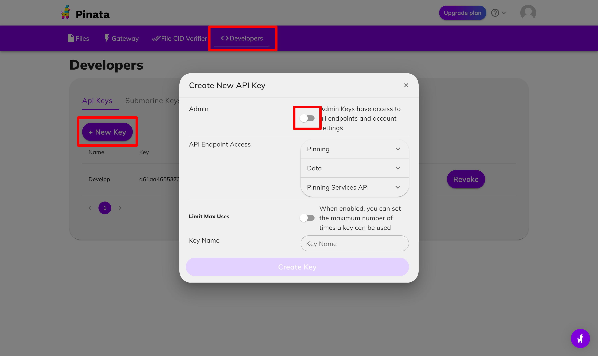
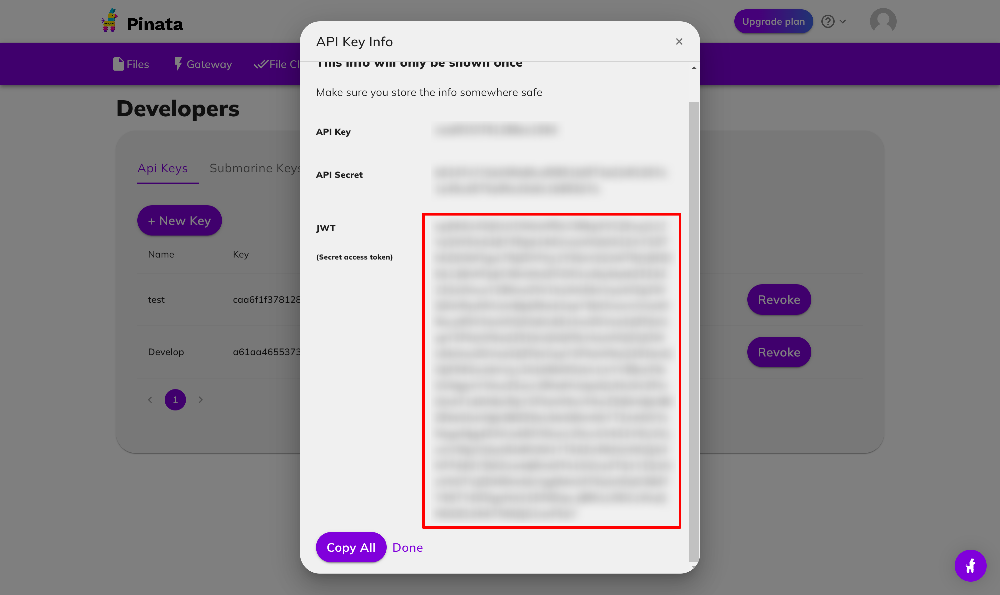

# Frontend development

## Install dependencies

```bash
yarn
```

## Create .env.local

```bash
cp .env.example .env.local
vi .env.local
```

Please update below three valuables. If you have told these values already, please specify them.

| Key                                   | Value                                                                                                                                            |
| ------------------------------------- | ------------------------------------------------------------------------------------------------------------------------------------------------ |
| NEXT_PUBLIC_FORWARDER_ADDRESS         | A forwarder contract address created by [localnode.md](localnode.md)                                                                             |
| NEXT_PUBLIC_CONTRACT_EVENT_MANAGER    | A event manager contract address created by [localnode.md](localnode.md)                                                                         |
| NEXT_PUBLIC_CONTRACT_MINT_NFT_MANAGER | A mint NFT manager contract address created by [localnode.md](localnode.md)                                                                      |
| NEXT_PUBLIC_PROVIDER_RPC              | A RPC URI of contract. ex. https://rpc-mumbai.maticvigil.com/v1/.... use `http://localhost:8545/` if you use local chain enrironment             |
| NEXT_PUBLIC_CHAIN_ID                  | An ID of the chain that serves the minting contract, `80001` or `137`. use `31337` if you use local chain enriromnent.                           |
| NEXT_PUBLIC_CHAIN_NAME                | A chain name: `Polygon Testnet` or `Polygon  Mainnet`. use `Localnet` for localnode.                                                             |
| NEXT_PUBLIC_BLOCK_EXPLORER_URL        | A Block Explorer URL `https://mumbai.polygonscan.com/` or `https://polygonscan.com`. use `http://localhost:8545/` for the local node.            |
| NEXT_PUBLIC_METAMASK_RPC_URL          | A PRC URL for the wallet `https://matic-mumbai.chainstacklabs.com` or `https://polygon-rpc.com`. use `http://localhost:8545/` for the local node |
| NEXT_PUBLIC_PINATA_JWT                | following instraction describing how to get pinata jwt.                                                                                          |
| NEXT_PUBLIC_PINATA_GATEWAY            | A general gateway uri is `gateway.pinata.cloud`. If you want to use your own gateway please refer pinata doc                                     |

## Create Pinata jwt

Go to [Pinata](https://www.pinata.cloud/) and create an account.



Generate API key



Copy API key

Set this jwt to **NEXT_PUBLIC_PINATA_JWT**

## Start server

```bash
yarn dev
```

You will see the website at `http://localhost:3000/`

## Help

### Got 400 error when getting NFT metadata on IPFS through Pinata

Because of Pinata gateway, cors error will occur on localhost. Please use this chrome extension for passing the error. [Moesif Origin & CORS Changer](https://chrome.google.com/webstore/detail/moesif-origin-cors-change/digfbfaphojjndkpccljibejjbppifbc). **Only development environment**
