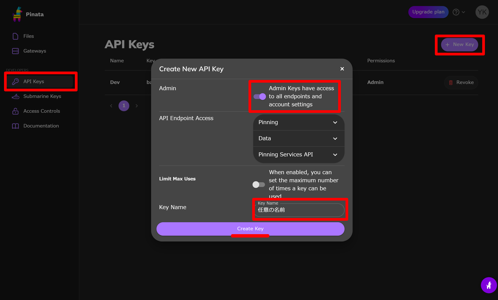
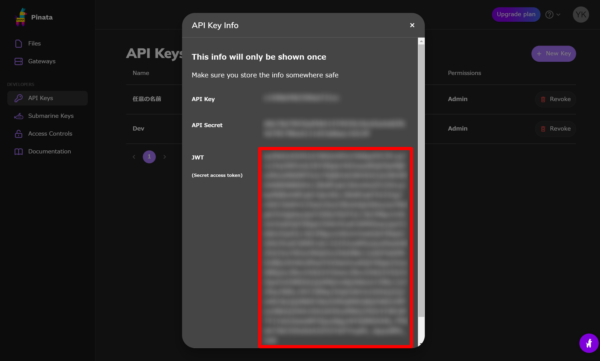
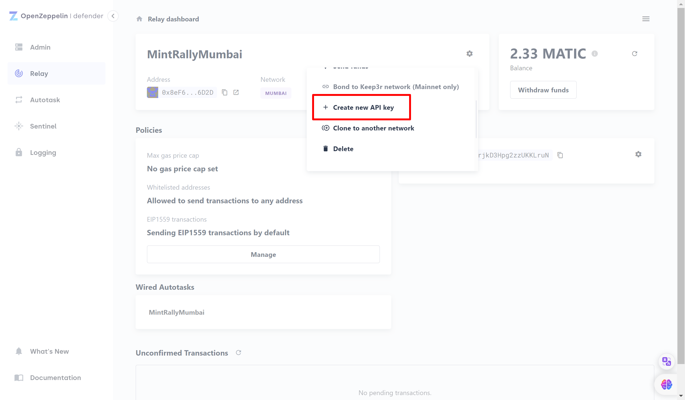

# Frontend develop environment

## Dependencies

**Node.js** v16 or v18  
**PackageManager** yarn  
**Next.js** v12

## Install dependencies

```bash
$ cd frontend
$ pwd
  {your_directories}/mint-rally/frontend
$ yarn
```

## Create .env.local

```bash
cp .env.example .env.local
vi .env.local
```

Please update variables, testnet and localnet vars are specified below. If you have told these values already, please specify them.

<details>
    <summary>
    with Testnet
    </summary>

| Key                                   | Value                                                                         |
| ------------------------------------- | ----------------------------------------------------------------------------- |
| NEXT_PUBLIC_FORWARDER_ADDRESS         | 0xe9a9403381Ae89595D7DE67e2512aDb914F17DA7                                    |
| NEXT_PUBLIC_CONTRACT_EVENT_MANAGER    | 0x4fe4F50B719572b3a5A33516da59eC43F51F4A45                                    |
| NEXT_PUBLIC_CONTRACT_MINT_NFT_MANAGER | 0xC3894D90dF7EFCAe8CF34e300CF60FF29Db9a868                                    |
| NEXT_PUBLIC_PROVIDER_RPC              | https://rpc-mumbai.maticvigil.com/v1/4c62b066c1b5fd168c89e508859fe6b55c9c8c5b |
| NEXT_PUBLIC_CHAIN_ID                  | 80001                                                                         |
| NEXT_PUBLIC_CHAIN_NAME                | Polygon Testnet                                                               |
| NEXT_PUBLIC_BLOCK_EXPLORER_URL        | https://mumbai.polygonscan.com/                                               |
| NEXT_PUBLIC_PINATA_JWT                | Following instraction describing how to get pinata jwt.                       |
| NEXT_PUBLIC_PINATA_GATEWAY            | gateway.pinata.cloud                                                          |
| OZ_RELAYER_API_KEYS                   | Openzeppelin Relayer API Keys                                                 |
| OZ_RELAYER_API_SECRETS                | Openzeppelin Relayer API Secrets                                              |

</details>

<details>
<summary>
with Localnet
</summary>

| Key                                   | Value                                                                       |
| ------------------------------------- | --------------------------------------------------------------------------- |
| NEXT_PUBLIC_FORWARDER_ADDRESS         | A forwarder contract address created by [localnode.md](localnode.md)        |
| NEXT_PUBLIC_CONTRACT_EVENT_MANAGER    | A event manager contract address created by [localnode.md](localnode.md)    |
| NEXT_PUBLIC_CONTRACT_MINT_NFT_MANAGER | A mint NFT manager contract address created by [localnode.md](localnode.md) |
| NEXT_PUBLIC_PROVIDER_RPC              | http://localhost:8545/                                                      |
| NEXT_PUBLIC_CHAIN_ID                  | 31337                                                                       |
| NEXT_PUBLIC_CHAIN_NAME                | Localnet                                                                    |
| NEXT_PUBLIC_BLOCK_EXPLORER_URL        | http://localhost:8545/                                                      |
| NEXT_PUBLIC_METAMASK_RPC_URL          | http://localhost:8545/                                                      |
| NEXT_PUBLIC_PINATA_JWT                | following instraction describing how to get pinata jwt.                     |
| NEXT_PUBLIC_PINATA_GATEWAY            | gateway.pinata.cloud                                                        |

</details>

## Create Pinata jwt

Go to [Pinata](https://www.pinata.cloud/) and create an account.



Generate API key



Copy API key

Set this jwt to **NEXT_PUBLIC_PINATA_JWT**

## Create Relayer API key

This process is needed for use meta transaction

Go to [OpenZeppelin Defender](https://defender.openzeppelin.com/) and create an account.

Then go to relayer page and create relayer, after that generate API Key.



Set this key and secret to **OZ_RELAYER_API_KEYS** and **OZ_RELAYER_API_SECRETS**

## Start server

```bash
$ yarn dev
```

You will see the website at `http://localhost:3000/`

## Help

### Got 400 error when getting NFT metadata on IPFS through Pinata

Because of Pinata gateway, cors error will occur on localhost. Please use this chrome extension for passing the error. [Moesif Origin & CORS Changer](https://chrome.google.com/webstore/detail/moesif-origin-cors-change/digfbfaphojjndkpccljibejjbppifbc). **Only development environment**
