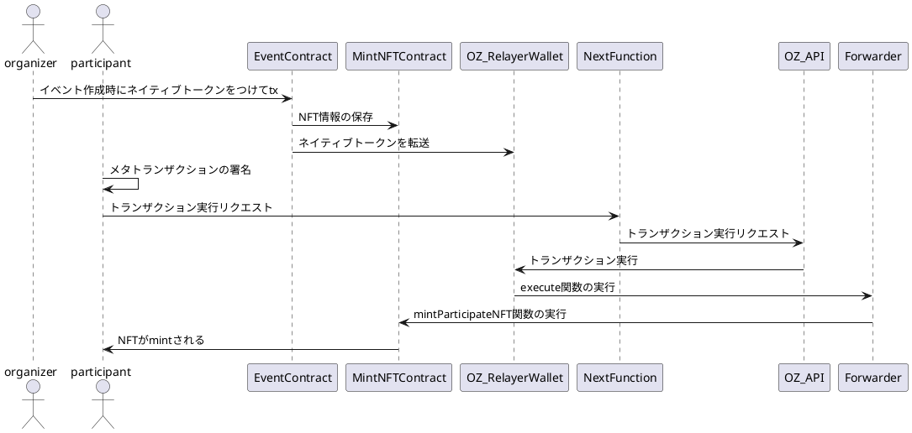

# 概要

****MintRally ではガス代となるネイティブトークンをもっていなくても使えるようにするために、メタトランザクションを実装しています。

現在はイベント作成者が事前にデポジットし、NFT を受け取るときのガス代を肩代わりできるようにしています。

## 使用技術

- [ERC2771](https://eips.ethereum.org/EIPS/eip-2771) に沿った Forwarder の実装
- [OpenZeppelin Defender Relayer](https://www.openzeppelin.com/defender) と [Openzeppelin Defender SDK](https://docs.openzeppelin.com/defender/v2/sdk)

## シーケンス

- organizer: イベントの主催者
- participant: イベントの参加者
- EventContract: イベント情報を管理するコントラクト
- MintNFTContract: 参加証明 NFT コントラクト
- Forwarder: メタトランザクションの Forwarder コントラクト
- NextFunction: Next.js で実装しているメタトランザクションエンドポイント
- OZ_RelayerWallet: OpenZeppelin が提供する Relayer の Wallet
- OZ_API: OpenZeppelin のリクエスト受け口となるエンドポイント
