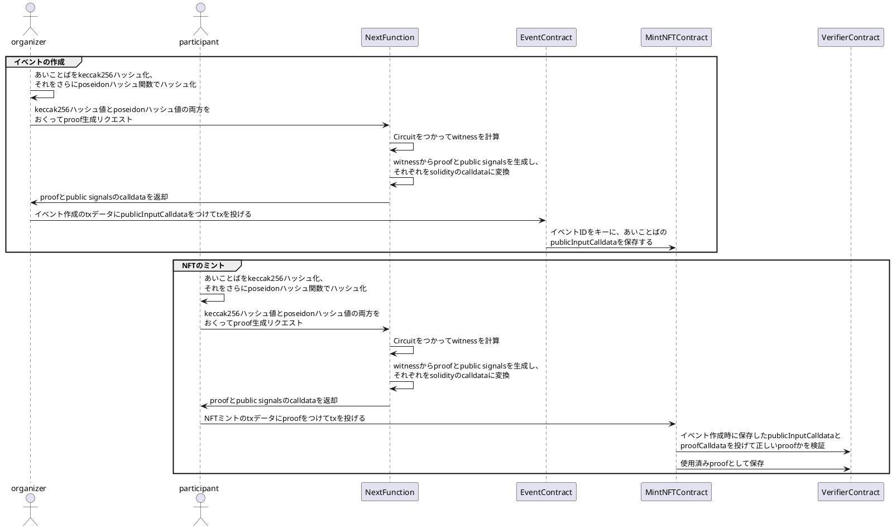

# 概要

MintRally で参加者が NFT をうけとるためには、主催者から聞いたあいことばを入力します。入力したあいことばは Poseidon ハッシュ関数のハッシュ値に変換されたあと、ゼロ知識証明（Plonk アルゴリズム）によって暗号化され、セキュアにスマートコントラクトに保存されます。

## 使用技術

- 回路実装: Circom
- アルゴリズム: Plonk
- Powers of Tau: powersOfTau28_hez_final_12.ptau

## シーケンス図

